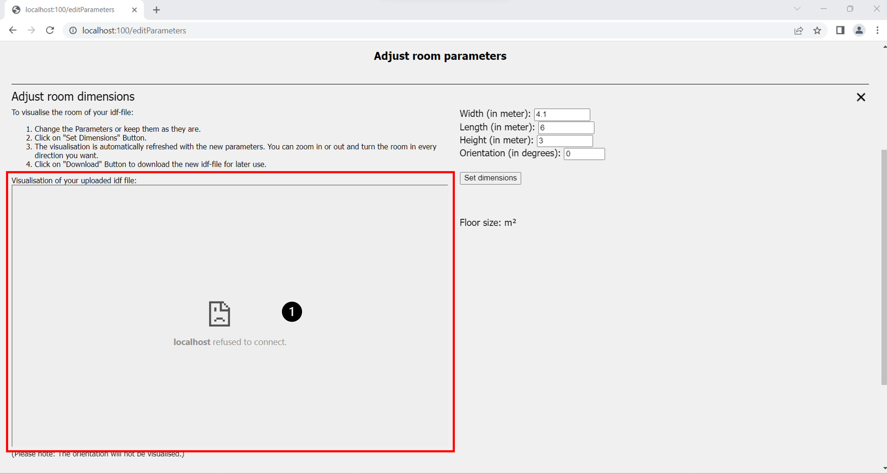

# Known Errors
 
In the following, we describe some known errors and possible solutions.

### EnergyPlus Error
The simulation was started, but EnergyPlus ran into an exception. An error file is automatically generated in the output folder and can be opened with a text viewer. This file is saved in the project folder in the subdirectory *./backend/eppy_output/* and is called "eplusout.err". The file is ordered by severness. The message labeled "Fatal" is the most important.  
Note: Different messages sometimes overlap, giving more information about the error.

### Leap Day

In leap years, February is 29 days long. EnergyPlus has problems simulating this day only.  
- Occurrence: run period defined for the leap day only (e.g.: 2024-02-29 - 2024-02-29)  
- Solution: simulate the 28th and the 29th of February, both days are calculated properly

Example eplusout.err error file for this example:
```
    ** Severe  ** Multiple rewinds on EPW while searching for first day 2/29
    **  Fatal  ** Error occurred on EPW while searching for first day, stopped at 1991/12/31 1:0 IO Error='no error'
```

### Room Visualization
The frontend provides the functionality to visualize a room before the simulation. For this, the open-source project [Ladybug Spider](http://www.ladybug.tools/spider-2021/spider-2021-11-02.html) is integrated and runs on a separate node.js server.  


*Figure 1*

Figure 1 shows the case where an error occurred during the startup of the server (marking 1).  
There are multiple possible error sources:
- Server is not running
- Node.js is not installed
- Network port is allocated to another program  

To see if the server is running, check the open command consoles. One of them should be dedicated to the visualization.  
The second point in the list is a typical reason for the console to close: The server is started by calling the node server,  
but without an installation, an error is thrown, and the console is closed immediately. Check the Node.js installation.  
Another explanation for why the visualization is not working lies in the connection between frontend and the visualization program.  
The node.js server is running on <b>port 50715</b>. This port may already be allocated to another program. In this case, it is only possible to switch the port by changing the programming. Look up, which ports are in use for your operating system and try closing the other program.

### Port Allocation
Summary of ports being used:<br>
Frontend: 100<br>
Backend:  5000<br>
Ladybug Spider:    50715<br>
MongoDB (Docker):  27017<br>

The port for the frontend can be changed in the configuration file *./frontend/frontend_config.ini*
```
[Frontend]
IP = 127.0.0.1
Port = 100

[Backend]
Address = localhost
Port = 5000
```

In this file, the port where the frontend is run can be changed under [Frontend]. The port set under [Backend] defines where to reach the backend application. If the backend is run on a different port, it must be updated here in order to allow communication between frontend and backend. 

If it is necessary to change the port of the visualization server (Ladybug Spider), this requires two code changes:<br>
1. In *./frontend/template/editParameters.html*, the correct port must be set for the iframe in line 52:

```
 <iframe src="http://localhost:50715" width="750" height="450"></iframe>
```

2. Also, the node.js server must be given the correct port by entering it in *./ladybug_spider/spider-idf-viewer/v-2020-10-09/server.js*:
```
const port = 50715;
```

Another port is used for the Docker container running MongoDB. It is configured to run on <b>port 27017</b>.
It is not recommended to change it, but in case it is necessary, the following steps are required:
1. Delete the old Docker container if one exists
2. Change the port in the docker container / Alternative: change the parameters in the "./installation.bat" (Windows) or "./installation.sh" (Linux) files.  

From:
```
docker run --name simulation_db -p 27017:27017 -d mongo:6.0.2
```
To the desired port:
```
docker run --name simulation_db -p <port>:<port> -d mongo:6.0.2
```
3. Change the path in the backend config file. (./backend/config.ini)
```
[MongoDB]
connection_string = mongodb://localhost:<port>
``` 


### Using the REST-API
Many control instances for the uploaded data are integrated into the frontend. Thus, using only the REST-API to interact with the backend requires extra careful verification of the parameters.
- Run Period:
    - Both days are not validated for consistency
    - End day equal or after the start day
    - Duration of the runperiod:
        - Equal or less than one year
        - Start year and end year always need to be equal
- Files:
    - File consistency is not checked
        - IDF file: structure and necessary elements are not previously checked
        - CSV file: 
            - file structure: day\|time\|occupants\|win1
            - file length: (rows % 1440) = 1, i.e., 1 header and 1440 rows with one for each minute of the day
            - time column format: HH:MM:SS
    - File encoded
    - File size does not exceed 16 megabytes (encoded!)
- Results: ESO-file format
