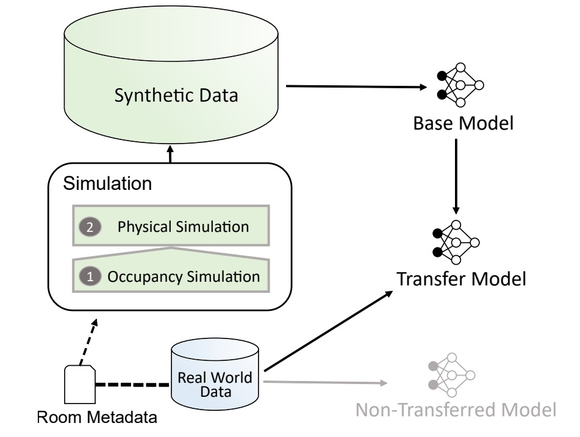

# Motivation

The EnergyPlus Room Simulator tool, can support research and practice in building-related tasks 
 such as energy optimization or occupancy detection on a room-level. 
In [Weber et al. 2020](https://dl.acm.org/doi/10.1145/3408308.3431124), the authors discuss an approach to use deep learning algorithms to detect presence in a room. 
They propose that an approach which combines real-world data and simulation data can reduce the required real-world training data by half, and in the same time contribute to a more robust model. 
This tool can provide an arbitrarily large amount of simulation data for this purpose, and it offers users without in-depth technical knowledge towards EnergyPlus to conduct and even automate simulations. 
  

*Deep learning approach for occupancy detection (Weber et al. 2020)*