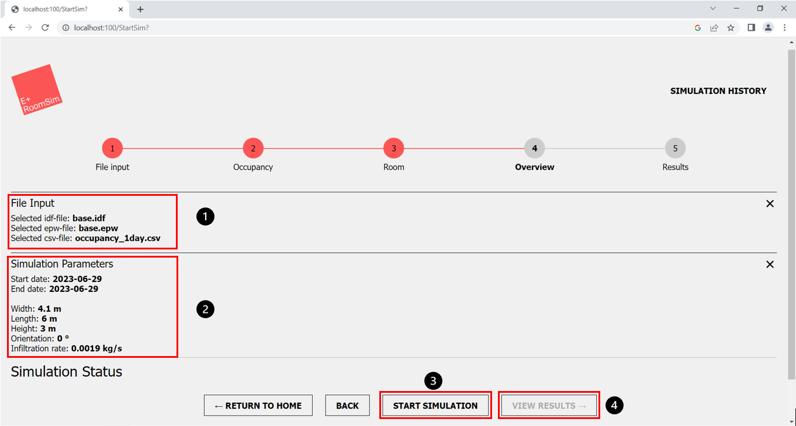
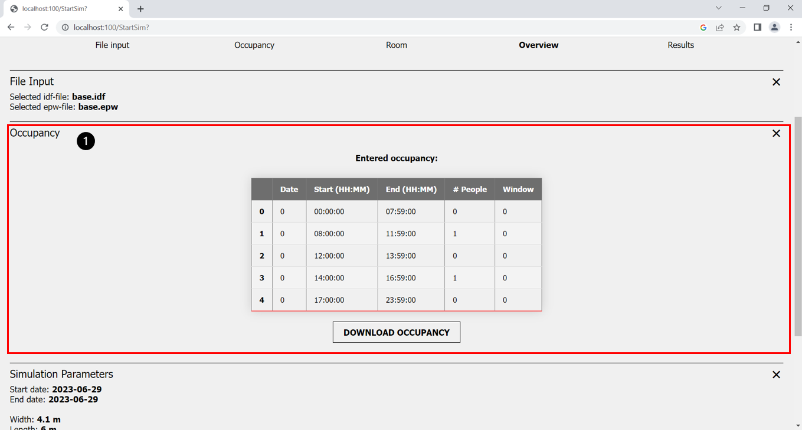
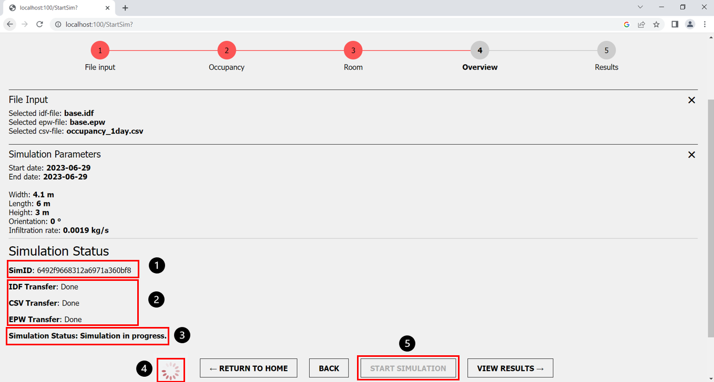
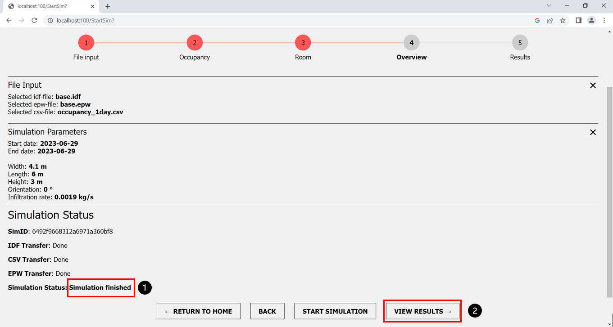

# Overview

This step of the web application takes you to the overview of simulation inputs and configurations, as well as the execution of the simulation itself.

*Figure 1: Step 4 Overview*

1. "+" button, to open "File input" section
2. "+" button, to open "Simulation Parameters" section
   
You can open the different sections via the buttons shown in (Fig. 1, marker 1 & 2).

## Simulation Parameters

The simulation overview allows you to view all inputs again before the simulation and to check their correctness.

*Figure 2: Overview with open sections*

1. Overview of chosen files
2. Overview of chosen simulation parameters
3. "Start Simulation" button, to start the simulation
4. "View Results" button, to proceed to the next step after the simulation has finished

For instance, in the File Input section (Fig. 2, marker 1), you can again view which IDF and EPW file you selected at the beginning. If you have uploaded an occupancy file, the uploaded file will also be shown in this section. If you have created a custom occupancy, there will be a different section shown, but this will be explained further down. In the simulation parameters section of the overview (Fig. 2, marker 2), you will again see the room dimensions and infiltration rate you specified for the simulation. If you notice that you have made an incorrect entry here, you can return via the back button to the step parameter input and adjust the values accordingly. If you are satisfied with the input data, you can now start the simulation. To do this, click on the "Start Simulation" button (Fig. 2, marker 3). The view results button will not be clickable and grey until the simulation is run (Fig. 2, marker 4). After the simulation was run successfully the button can be clicked. 

*Figure 3: Overview custom occupancy*

1. Overview over the created custom occupancy

In the section occupancy (Fig. 3, marker 1), you can view the custom room occupancy created in process step 2. This occupancy section is only shown if you have choosen to create a custom occupancy in step 2, If you have uploaded an occupancy file, the file will be shown in the File input section.

## Simulation status 

*Figure 4: Overview - simulation status*

1. Simulation ID
2. File transfer status information
3. Simulation status information
4. Loading circle to visualise the simulation is currently running
5. "Start Simulation" button, grey while running a simulation

If you have started the simulation with a click on the "Start Simulation" button (Fig. 4, marker 5), the simulation will begin and the button will be grey. Once you have started the simulation, the simulation ID will be displayed at the top (Fig. 4, marker 1), allowing you to clearly distinguish between the different simulations. Within the next few seconds, you will now be continuously informed about the progress of the simulation.

In order for EnergyPlus to run the simulation with the data you have provided, the first step is to transfer the data from the frontend (GUI) to the backend. This happens automatically and you will be informed in real time about the data packages transferred in sequence, such as the IDF or EPW file (Fig. 4, marker 2). Once this is done, Energyplus will start the execution of the simulation and you will be shown a loading circle while the simulation is running (Fig. 4, marker 4). While the simulation is running, you the status "simulation in progress" (Fig. 4, marker 3) is displayed.

*Figure 5: Overview simulation finished*

1. Simulation status "finished", after simulation is run successfully
2. "View results" button, to proceed to the next step

After the simulation has been run successfully, you will receive a "simulation finished" success message (Fig. 5, marker 1). The "View Results" Button  (Fig. 5, marker 2) will take you to the next step of the web application where you can plot the results of the simulation and download the complete results as a CSV file or ESO file.
