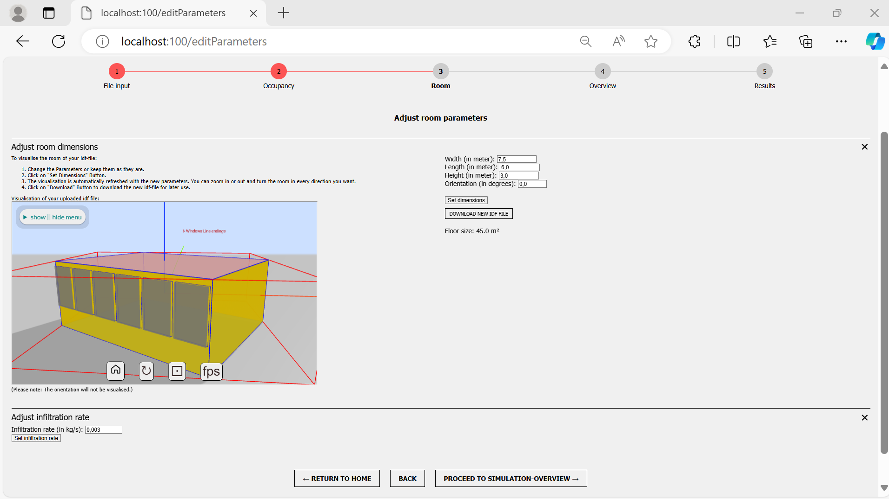

# EnergyPlus Room Simulator

This is a Python-based web application that allows the simulation of indoor climate (temperature, humidity, CO2) in standalone rooms (zones) for data generation purposes using the simulation software EnergyPlus.<br><br>
For this, an easy-to-use and straightforward GUI is provided, along with a REST API supporting the automation of simulations. It is possible to simulate the indoor climate of a room with individual IDF and EPW files. Furthermore, adjustments can be made to occupancy (presence of people and window openings), room dimensions, room orientation, and infiltration rate. Before starting the simulation, the modified version of a room model can be visualized. After the simulation, plots of the simulation results can then be displayed, and the simulation results can be downloaded as a CSV file and an ESO file. All inputs and outputs are persistently stored in a NoSQL database (MongoDB).

The application is primarily written in Python and uses the Python package *eppy* to work with EnergyPlus.<br>
It is divided into a frontend (GUI) and a backend (REST API), which are implemented as two separate Python Flask servers. 

<p style="float:left;">
    
    
</p>
<p style="float:left;">
  
</p>

***
## Documentation

Further documentation can be found [here](https://ccwi.github.io/EP-Room-Simulator/). 

You may also watch our [Demo Video](https://ccwi.github.io/EP-Room-Simulator/images/demo_video.mp4). 

***

## Installation 
To install the software, you need an installation of<br>
Python 3.10, <br>
EnergyPlus version 22-2-0 or 23-1-0,<br>
and either Windows cmd.exe or Linux Bash console.<br>
Additionally, a recent version of Docker must be installed on the machine or a local installation of MongoDB.<br> 
Furthermore, node.js is required in order to be able to use the visualization functionality of the tool.<br>
The installation is then performed through the installation script <i>install.py</i>.

### Important!
The script performs either a complete installation or simply starts the resources and the program. The complete installation includes creating a virtual Python VENV environment, downloading and starting the MongoDB image and container, installing all required Python packages, and starting the frontend and backend. The simple start involves starting the existing MongoDB Docker container and the program. It is important to note that for a complete installation, a system path equality check is performed. This check is successful only if no virtual environment is activated. Therefore, to perform a completely fresh installation, all existing currently activated virtual environments must be deactivated. On the other hand, for a simple start of the programs (if an installation has already been performed), the dedicated VENV created by the installation needs to be manually activated before running the script. 

### Installation on Windows (for Windows 10 / 11)
*Prerequisites:* Installation of [Docker](https://www.docker.com/), [EnergyPlus](https://energyplus.net/) and [node.js](https://nodejs.org/en)

You may use the <i>installation.bat</i> file and the three run files (<i>run_backend.bat</i>, <i>run_frontend.bat</i>, <i>run_spider.bat</i>) to install and run the application. Alternatively, you may use the following commands.<br>

Run the script install.py after you navigated to your project folder:
```
 python install.py
```

After the first installation, you can use the same command *python install.py* to start all three components at once. Three console windows should open up (backend, frontend, spider server). Alternatively, you can start the components individually by the following commands.

Start frontend, backend, and spider server individually:
```
cd frontend
python -m app
```
```
cd backend
python -m app
```
```
cd ladybug_spider/spider-idf-viewer/v-2020-10-09/
node server.js
```

If only the REST API is needed, the backend application can be run standalone.<br>
However, if the frontend is started without the backend, it will not be able to perform any simulation!<br>
Always make sure, that the MongoDB instance is accessible (Docker is running).
