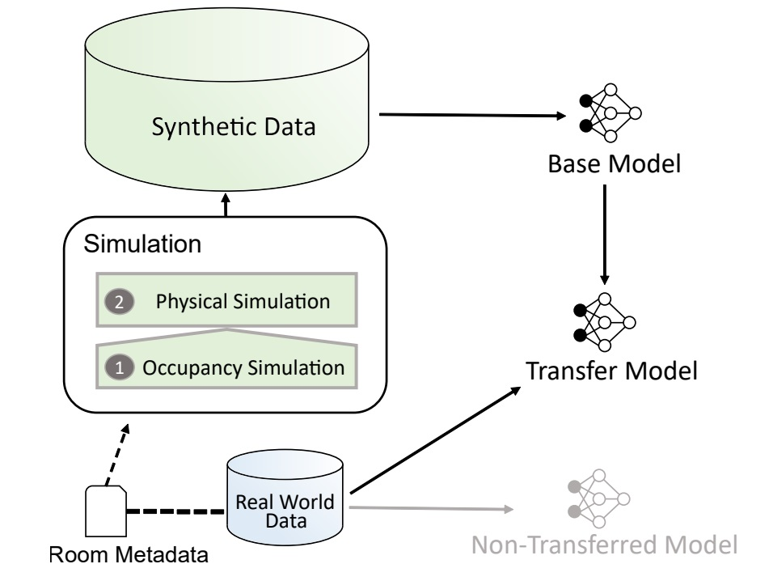

# EnergyPlus Room Simulator

*Screenshot from the application*

This program is intended to simplify the application of EnergyPlus for room climate simulation.
It is a Python-based web application that allows the simulation of indoor climate (temperature, humidity, CO2) in standalone rooms (zones) for data generation purposes using the simulation software EnergyPlus.

For this, an easy-to-use and straightforward GUI is provided, along with a REST API supporting the automation of simulations. It is possible to simulate the indoor climate of a room with individual IDF and EPW files. Furthermore, adjustments can be made to occupancy (presence of people and window openings), room dimensions, room orientation, and infiltration rate. Before starting the simulation, the modified version of a room model can be visualized. After the simulation, plots of the simulation results can be displayed, and the simulation results can be downloaded as a CSV file and an ESO file. All inputs and outputs are persistently stored in a NoSQL database (MongoDB).

This documentation provides you with information on how to install and use this tool.

## Architecture

The application is primarily written in Python and uses the Python package eppy to work with EnergyPlus.
It is divided into a frontend (GUI) and a backend (REST API), which are implemented as two separate Python Flask web servers. Simulation data is saved in an MongoDB instance, provided via a Docker container.
The following figure illustrates this architecture.

*Architecture*

## Motivation

The EnergyPlus Room Simulator tool, can support research and practice in building-related tasks 
 such as energy optimization or occupancy detection on a room-level. 
In [Weber et al. 2020](https://dl.acm.org/doi/10.1145/3408308.3431124), the authors discuss an approach to use deep learning algorithms to detect presence in a room. 
They propose that an approach which combines real-world data and simulation data can reduce the required real-world training data by half, and in the same time contribute to a more robust model. 
This tool can provide an arbitrarily large amount of simulation data for this purpose, and it offers users without in-depth technical knowledge towards EnergyPlus to conduct and even automate simulations. 

*Deep learning approach for occupancy detection (Weber et al. 2020)*
